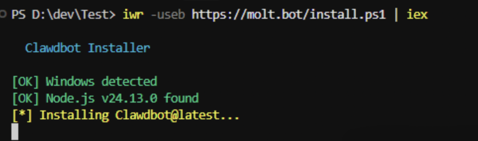
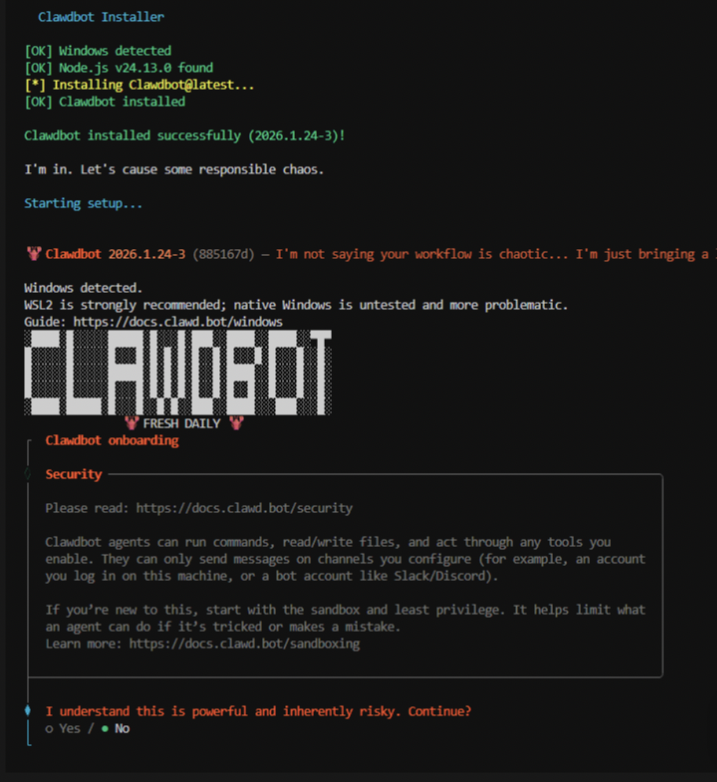
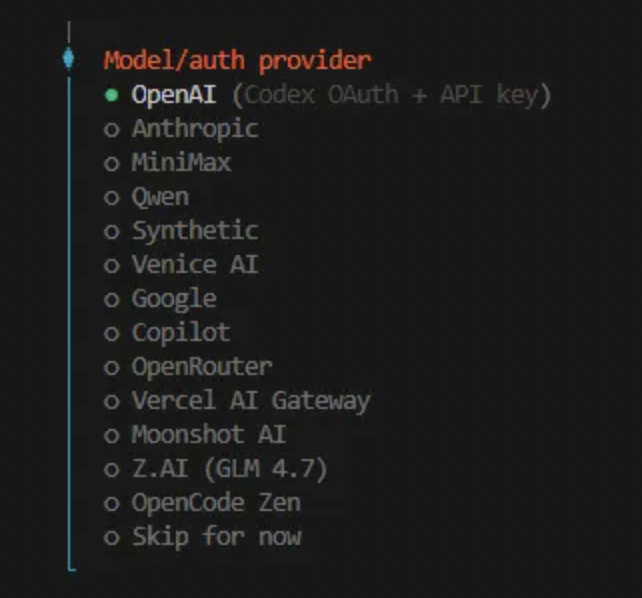
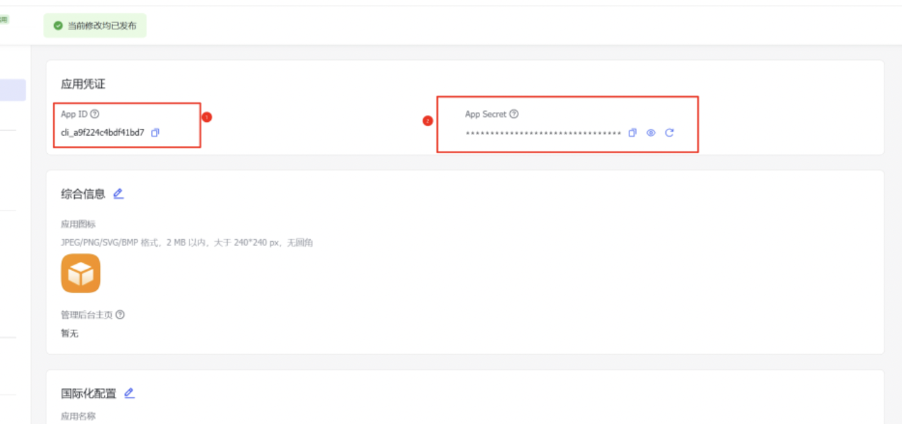
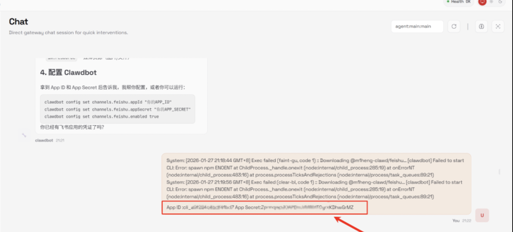
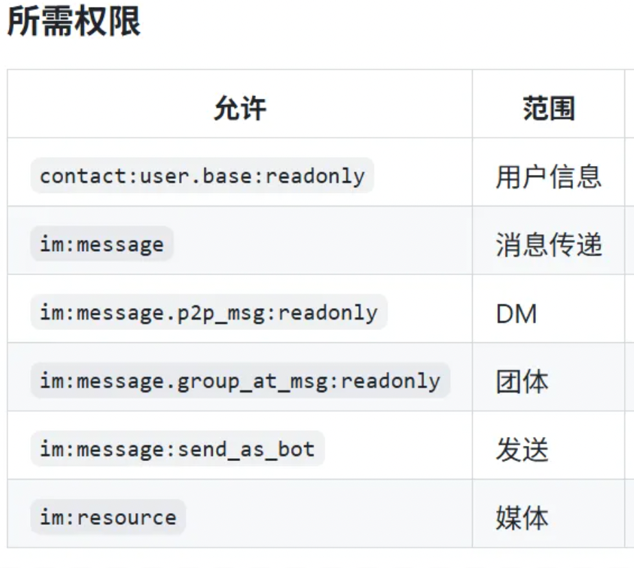
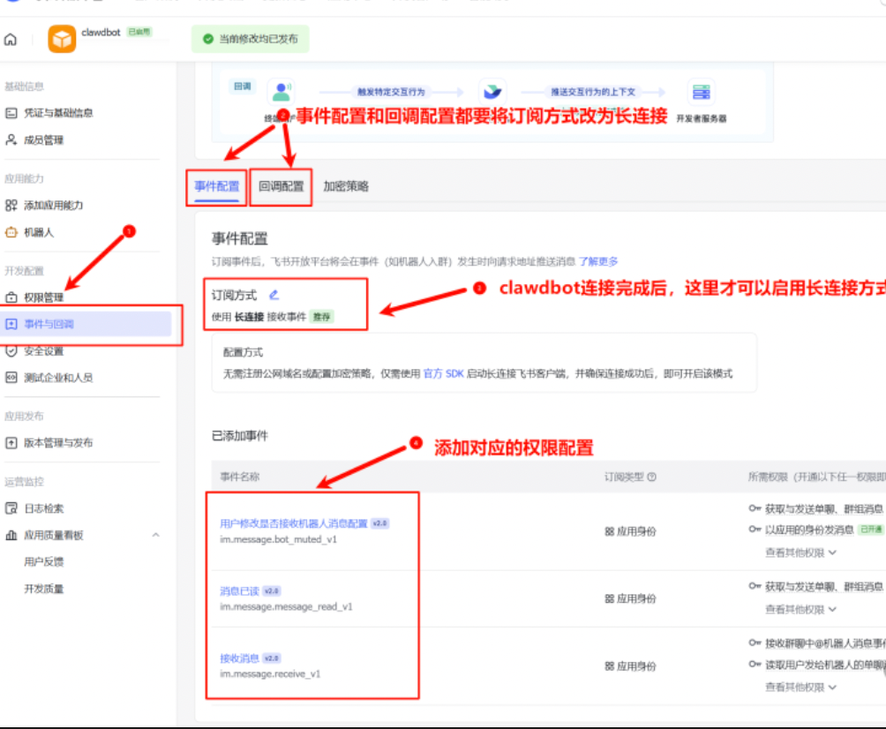
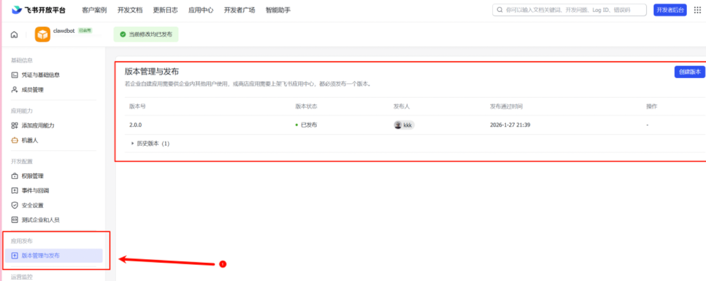

# **openclaw安装教程：从零开始到接入飞书！**


## **开始安装**


我这里教大家怎么装，以及如何接入飞书，让我们在国内也能玩起来。


**一定注意安全问题！**


这玩意权限很高，一定要悠着点。

如果你直接在主力机上跑，万一AI抽风执行个 `rm -rf /`，你电脑里的那资料可全完了。


------

## **第一步：安装openclaw**

一行命令就行，很简单。

下面的命令适用于Mac、Windows和Linux。

```js
curl -fsSL https://openclaw.ai/install.sh | bash
```

**注意**：运行前要先装Node.js，得22版本以上，否则会报错。

然后你就能看到它开始安装了。



安装好后，会出现这个：



问你选yes还是no。

意思就是：我懂这大龙虾能力很强但风险极大，你确认继续吗？

只有选yes，才让你进行下一步。


选yes后，会看到一个选项：


第一个是快速启动，后续通过 `openclaw configure` 配置信息。

第二个是先手动配置。

我们选第一个。

------

## **第二步：配置模型**

然后它会让你配置模型。




你也可以选国产模型，比如MiniMax、Qwen、智谱。


**优势：**

- ✅ 国内直连，无需魔法
- ✅ 价格便宜，比官方便宜50%-70%
- ✅ 支持支付宝、微信支付
- ✅ 支持Claude、GPT、Gemini等多种模型
- ✅ 24小时稳定运行


**提醒一句**：

这玩意上下文工程做得奇差无比。

烧Token的速度是你难以想象的离谱。

------


## **第三步：配置Skills**


每个后面都有描述，你可以挑喜欢的装。

懒得挑，直接跳过也行，后续跟它对话也能装。

------

## **第五步：配置Hooks**

继续下一步，会问你要不要配置hooks。

可以理解为三个插件：

**boot-md**：启动时自动加载一段markdown文本当默认引导内容。常用于把你的规则、偏好、项目背景在每次启动时塞进去。

**command-logger**：把你在openclaw里执行过的命令和关键操作记一份日志，方便排查问题和复盘。如果你比较在意隐私或不想留痕，就别开它。

**session-memory**：保存会话相关的状态或记忆，让它下次能延续上下文，体验会更连贯。

我建议都开，都非常实用。

------

## **第六步：启动openclaw**

终于，一切就绪！

用这个命令启动：

```
openclaw gateway --verbose
```


一般端口默认是18789，所以你可以直接访问：

```
http://127.0.0.1:18789/chat
```

然后就能看到亲切的小龙虾界面了！

------

## **第七步：接入飞书（重点！）**

我相信所有人，肯定都想在手机端或别的聊天软件里用。

这才是它最大的魅力。

在国内，现在最容易接进去的，就是飞书。

因为飞书的机器人，刚好跟这玩意非常吻合。

有个大佬做了飞书连接open的项目：

https://github.com/m1heng/openclaw-feishu

直接在WebUI输入：

```
给我安装 openclaw plugins install @m1heng-clawd/feishu 这个命令
```


------

## **配置飞书机器人**

它说装好后，还需要去飞书开放平台（open.feishu.cn）建个应用。

把App ID和App Secret记下来，接下来要用。



然后最骚的操作来了...

你直接在对话框中发送自己的App ID和App Secret给它。

没错，它会自己看着办，把剩下的配置全给你搞定。



真的，爽到爆炸。

------

## **飞书开放平台设置**

然后就是飞书开放平台自己的一些设置了。

这个就不太好上AI了，而且也不复杂。

大家先把机器人加入进去：


接下来开启一些必要的权限，GitHub中作者也有讲到：




然后，把下面这些也都配置上：



最后，一切大功告成！

然后你就进行发布：



就可以在飞书里面，跟它畅聊了。


------

## **实际使用体验**

比如公司报销发票，需要把发票内容填进一个Excel表格模板里

现在，只需在飞书给它下个令。

它便会在后台一顿操作：

- 打开本地文件
- 读取内容
- 自动填充Excel

一眨眼的功夫，活儿干完了。

这台电脑我就一直放在那，也没打算关机。

晚上回了家，我还是可以用手机上飞书，来对它进行遥控。

还是相当好玩的。

------
